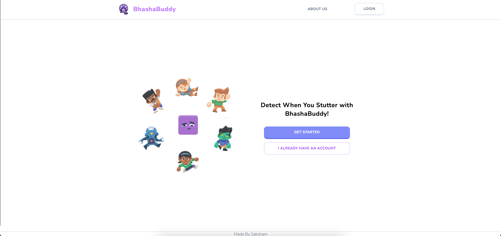

# Introduction
Bhasha Buddy is a web-application targeting people with speaking Disabilities like stuttering,blocking etc.
It has Deep Learning Model integerated to idenity a persons disablilty and providing them with appropriate worksheets to improve themseleves
Users are also provided with the contact information of doctors available near them for further improvement and a proffesional consultation


## Tech Stack

- [Next.js](https://nextjs.org/) – framework
- [TypeScript](https://www.typescriptlang.org/) – language
- [Tailwind](https://tailwindcss.com/) – CSS
- [Neon](https://neon.tech/) – database
- [Clerk](https://clerk.com/) – auth


## Running Locally
It is written in Nextjs 
This is a [Next.js](https://nextjs.org/) project bootstrapped with [`create-next-app`](https://github.com/vercel/next.js/tree/canary/packages/create-next-app).

To run the application run the follwing command
```bash
npm run dev
# or
yarn dev
# or
pnpm dev
# or
bun dev
```
## Enviornment Variables
Add a .env file in the root directory and add the following variables
```bash
NEXT_PUBLIC_CLERK_PUBLISHABLE_KEY
CLERK_SECRET_KEY
NEXT_PUBLIC_URL_WHISPER 
NEXT_PUBLIC_URL_MODEL 
NEXT_PUBLIC_URL_DIFFUSION
DATABASE_URL
```

Open [http://localhost:3000](http://localhost:3000) with your browser to see the result.


